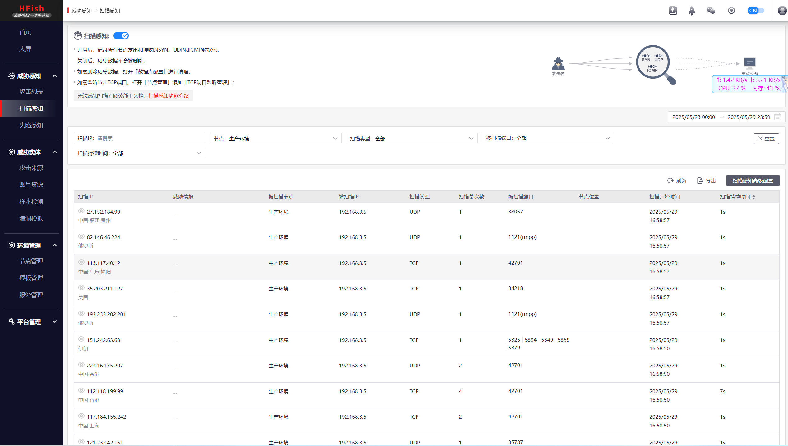
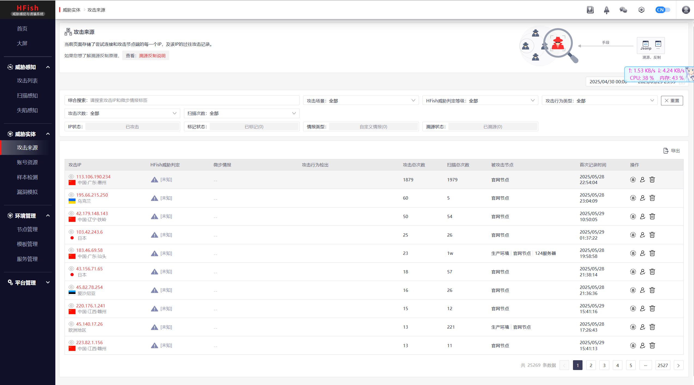
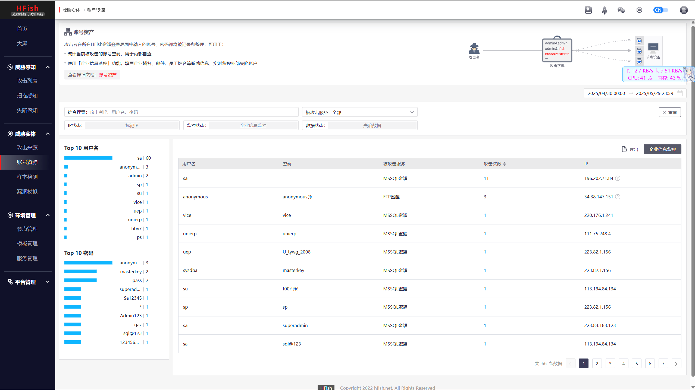

# 概述

蜜罐技术本质上是一种对攻击方进行欺骗的技术，通过布置一些作为诱饵的主机、网络服务或者信息，诱使攻击方对它们实施攻击，从而可以对攻击行为进行捕获和分析，了解攻击方所使用的工具与方法，推测攻击意图和动机，能够让防御方清晰地了解他们所面对的安全威胁，并通过技术和管理手段来增强实际系统的安全防护能力

蜜罐好比是情报收集系统。蜜罐好像是故意让人攻击的目标，引诱黑客前来攻击。所以攻击者入侵后，你就可以知道他是如何得逞的，随时了解针对服务器发动的最新的攻击和漏洞。还可以通过窃听黑客之间的联系，收集黑客所用的种种工具，并且掌握他们的社交网络


## 主要分类

### 1. 按交互程度分类

- **低交互蜜罐**：模拟有限服务（如只模拟FTP登录），风险低但信息有限
- **中交互蜜罐**：模拟部分操作系统功能，能获取更多攻击信息
- **高交互蜜罐**：真实操作系统和应用程序，风险高但能获取最全面攻击数据

### 2. 按用途分类

- **研究型蜜罐**：用于学术研究，收集攻击数据
- **生产型蜜罐**：保护企业网络，检测实际威胁

### 3. 按形式分类

- **服务器蜜罐**：模拟易受攻击的服务器
- **客户端蜜罐**：模拟易受攻击的客户端（如浏览器）
- **蜜网(Honeynet)**：由多个蜜罐组成的网络


## 核心技术原理

1. **欺骗技术**：通过模拟漏洞、虚假数据等诱使攻击者上钩
2. **数据控制**：限制蜜罐对内部网络的访问，防止成为跳板
3. **数据捕获**：记录所有输入输出、网络流量和系统活动
4. **数据分析**：对收集的数据进行分析，提取攻击特征


## 主要功能与价值

1. **威胁检测**：发现新型攻击手段和0day漏洞
2. **攻击分析**：研究攻击者的工具、策略和动机
3. **安全预警**：提前发现针对组织的针对性攻击
4. **取证调查**：为安全事件提供法律证据
5. **安全研究**：帮助开发更好的防御措施


## 典型应用场景

1. 企业网络安全防护
2. 政府机构关键基础设施保护
3. 网络安全厂商威胁情报收集
4. 学术机构网络安全研究
5. 云服务提供商安全监测


## 优势与局限

**优势**：

- 减少误报（蜜罐上的所有活动都可疑）
- 资源消耗低（只需监控少量系统）
- 能发现未知威胁
- 提供深度攻击信息

**局限**：

- 只能检测针对蜜罐的攻击
- 高交互蜜罐存在被用作跳板的风险
- 需要专业知识部署和维护
- 可能涉及法律问题（如隐私）


## 发展趋势

1. **智能化**：结合AI技术自动分析攻击行为
2. **云蜜罐**：基于云服务的分布式蜜罐系统
3. **IoT蜜罐**：针对物联网设备的专用蜜罐
4. **欺骗防御**：与整个欺骗防御体系整合


# 蜜罐系统

市面上有许多免费的蜜罐系统可供选择，以下是一些比较知名的免费蜜罐系统及其特点：


## 1. **DecoyMini（吉星·智能仿真与诱捕防御工具）**

- **特点**：
  - 完全免费，支持插件化仿真模板，可一键下载部署。
  - 提供可视化编排能力，可自定义蜜罐。
  - 支持本地高质量威胁情报输出，可联动网关封堵攻击。
  - 支持 Windows、Linux（CentOS/Ubuntu/Debian/Kali）及树莓派等平台。
- **适用场景**：企业内网威胁感知、攻击诱捕与溯源分析。
- **来源**：[GitHub - DecoyMini](https://github.hscsec.cn/decoymini/DecoyMini)。


## 2. **HFish**

- **特点**：
  - 基于 Golang 开发，跨平台（Windows/Linux/ARM/国产 CPU）。
  - 支持 40+ 种蜜罐环境（如 SSH、FTP、Web、OA、IoT 设备等）。
  - 提供云蜜网、自定义蜜饵、多告警方式（邮件/企业微信/钉钉等）。
  - 采用 B/S 架构，管理端与节点端分离。
- **适用场景**：内网失陷检测、外网威胁感知、威胁情报生产。
- **来源**：[HFish 蜜罐介绍](http://cn-sec.com/archives/3595269.html)。


## 3. **Modern Honey Network (MHN)**

- **特点**：
  - 支持多种开源蜜罐（如 Dionaea、Kippo、Conpot、Glastopf 等）。
  - 提供集中管理界面，可快速部署蜜罐节点。
  - 数据存储在 MongoDB，支持 API 访问。
- **适用场景**：研究攻击行为、收集威胁情报。
- **来源**：[蜜罐网络（MHN）](http://chatgpt.dhexx.cn/article/uk8pa8PE.shtml)。


## 4. **Dionaea**

- **特点**：
  - 低交互蜜罐，模拟 FTP、HTTP、SMB 等服务。
  - 可捕获恶意软件样本，适用于恶意代码分析。
- **适用场景**：恶意软件捕获、漏洞利用分析。
- **来源**：[MHN 支持的蜜罐](http://chatgpt.dhexx.cn/article/uk8pa8PE.shtml)。


## 5. **Kippo (SSH 蜜罐)**

- **特点**：
  - 模拟 SSH 服务，记录攻击者登录行为。
  - 支持文件下载记录，适用于 SSH 暴力破解分析。
- **适用场景**：SSH 攻击监测、暴力破解分析。
- **来源**：[Kippo 介绍](http://chatgpt.dhexx.cn/article/uk8pa8PE.shtml)。


## 6. **Conpot (工控蜜罐)**

- **特点**：
  - 模拟工业控制系统（ICS/SCADA）设备。
  - 支持 Modbus、SNMP 等工控协议。
- **适用场景**：工控网络安全研究。
- **来源**：[Conpot 蜜罐](http://chatgpt.dhexx.cn/article/uk8pa8PE.shtml)。


## 7. **Glastopf (Web 蜜罐)**

- **特点**：
  - 模拟 Web 应用漏洞（如 SQL 注入、文件包含）。
  - 记录攻击者利用 Web 漏洞的行为。
- **适用场景**：Web 攻击分析。
- **来源**：[Glastopf 介绍](http://chatgpt.dhexx.cn/article/uk8pa8PE.shtml)。


| 蜜罐系统  |     类型     |          适用场景          |
| :-------: | :----------: | :------------------------: |
| DecoyMini |  企业级蜜罐  |   内网威胁感知、攻击诱捕   |
|   HFish   |  多功能蜜罐  | 内网失陷检测、外网威胁感知 |
|    MHN    | 蜜罐管理平台 |       多蜜罐集中管理       |
|  Dionaea  |  低交互蜜罐  |        恶意软件捕获        |
|   Kippo   |   SSH 蜜罐   |        SSH 攻击监测        |
|  Conpot   |   工控蜜罐   |     ICS/SCADA 安全研究     |
| Glastopf  |   Web 蜜罐   |        Web 攻击分析        |


# HFish

## 概述

HFish是一款社区型免费蜜罐，侧重企业安全场景，从内网失陷检测、外网威胁感知、威胁情报生产三个场景出发，为用户提供可独立操作且实用的功能，通过安全、敏捷、可靠的中低交互蜜罐增加用户在失陷感知和威胁情报领域的能力

HFish支持基本网络 服务、OA系统、CRM系统、NAS存储系统、Web服务器、运维平台、安全产品、无线AP、交换机/路由器、邮件系统、IoT设备等90多种蜜罐服务、支持用户制作自定义Web蜜罐、支持流量牵引到免费云蜜网、支持可开关的全端口扫描感知能力、支持可自定义的蜜饵配置、一键部署、跨平台多架构，支持Linux x32/x64/ARM、Windows x32/x64平台和多种国产操作系统、支持龙芯、海光、飞腾、鲲鹏、腾云、兆芯等国产CPU、极低的性能要求、邮件/syslog/webhook/企业微信/钉钉/飞书告警等多项特性，帮助用户降低运维成本，提升运营效率。


## 为什么选择HFish

蜜罐通常被定义为具有轻量级检测能力、低误报率的检测产品，同时它也是企业生产本地威胁情报的优质来源之一。HFish可以帮助中小型企业用户在日常安全运营中进行避免告警洪水、低成本的增加威胁感知和情报生产能力。目前，社区的力量正在不断帮助HFish完善自身，共同探索欺骗防御的最佳实践。

HFish被广泛应用于感知办公内网、生产环境、云内网及其他环境失陷主机横向移动、员工账号外泄、扫描和探测行为、私有情报生产甚至内部演练和安全意识培训，HFish的多种告警输出形式与态感、NDR、XDR或日志平台结合，极大拓展检测视野。


## 官网

https://hfish.net/


## 架构

HFish采用B/S架构，HFish由管理端（server）和节点端（client）组成，管理端用来生成和管理节点端，并接收、分析和展示节点端回传的数据，节点端接受管理端的控制并负责构建蜜罐服务。

在HFish中，**管理端**只用于**数据的分析和展示**，**节点端**进行**虚拟蜜罐**，最后由**蜜罐来承受攻击**


## Linux部署


一键部署：

```sh
firewall-cmd --add-port=4433/tcp --permanent   #（用于web界面启动）
firewall-cmd --add-port=4434/tcp --permanent   #（用于节点与管理端通信）
firewall-cmd --reload
```


```sh
bash <(curl -sS -L https://hfish.net/webinstall.sh)
```


```sh
登陆链接：https://[ip]:4433/web/
账号：admin
密码：HFish2021
```


手动安装：

https://hfish.cn-bj.ufileos.com/hfish-3.3.5-linux-amd64.tgz

https://hfish.cn-bj.ufileos.com/hfish-3.3.5-linux-arm64.tgz


解压：

```sh
tar zxvf hfish-3.3.5-linux-amd64.tgz -C /home/user/hfish
```


开放端口：

```sh
sudo firewall-cmd --add-port=4433/tcp --permanent   （用于web界面启动）
sudo firewall-cmd --add-port=4434/tcp --permanent   （用于节点与管理端通信）
sudo firewall-cmd --reload
```


运行：

```sh
cd /home/user/hfish
sudo ./install.sh
```


或者直接运行：

```sh
./server
```


登录：

```sh
登陆链接：https://[ip]:4433/web/
账号：admin
密码：HFish2021
```


修改密码：











