# 概述

蜜罐技术本质上是一种对攻击方进行欺骗的技术，通过布置一些作为诱饵的主机、网络服务或者信息，诱使攻击方对它们实施攻击，从而可以对攻击行为进行捕获和分析，了解攻击方所使用的工具与方法，推测攻击意图和动机，能够让防御方清晰地了解他们所面对的安全威胁，并通过技术和管理手段来增强实际系统的安全防护能力

蜜罐好比是情报收集系统。蜜罐好像是故意让人攻击的目标，引诱黑客前来攻击。所以攻击者入侵后，你就可以知道他是如何得逞的，随时了解针对服务器发动的最新的攻击和漏洞。还可以通过窃听黑客之间的联系，收集黑客所用的种种工具，并且掌握他们的社交网络


## 主要分类

### 1. 按交互程度分类

- **低交互蜜罐**：模拟有限服务（如只模拟FTP登录），风险低但信息有限
- **中交互蜜罐**：模拟部分操作系统功能，能获取更多攻击信息
- **高交互蜜罐**：真实操作系统和应用程序，风险高但能获取最全面攻击数据

### 2. 按用途分类

- **研究型蜜罐**：用于学术研究，收集攻击数据
- **生产型蜜罐**：保护企业网络，检测实际威胁

### 3. 按形式分类

- **服务器蜜罐**：模拟易受攻击的服务器
- **客户端蜜罐**：模拟易受攻击的客户端（如浏览器）
- **蜜网(Honeynet)**：由多个蜜罐组成的网络


## 核心技术原理

1. **欺骗技术**：通过模拟漏洞、虚假数据等诱使攻击者上钩
2. **数据控制**：限制蜜罐对内部网络的访问，防止成为跳板
3. **数据捕获**：记录所有输入输出、网络流量和系统活动
4. **数据分析**：对收集的数据进行分析，提取攻击特征


## 主要功能与价值

1. **威胁检测**：发现新型攻击手段和0day漏洞
2. **攻击分析**：研究攻击者的工具、策略和动机
3. **安全预警**：提前发现针对组织的针对性攻击
4. **取证调查**：为安全事件提供法律证据
5. **安全研究**：帮助开发更好的防御措施


## 典型应用场景

1. 企业网络安全防护
2. 政府机构关键基础设施保护
3. 网络安全厂商威胁情报收集
4. 学术机构网络安全研究
5. 云服务提供商安全监测


## 优势与局限

**优势**：

- 减少误报（蜜罐上的所有活动都可疑）
- 资源消耗低（只需监控少量系统）
- 能发现未知威胁
- 提供深度攻击信息

**局限**：

- 只能检测针对蜜罐的攻击
- 高交互蜜罐存在被用作跳板的风险
- 需要专业知识部署和维护
- 可能涉及法律问题（如隐私）


## 发展趋势

1. **智能化**：结合AI技术自动分析攻击行为
2. **云蜜罐**：基于云服务的分布式蜜罐系统
3. **IoT蜜罐**：针对物联网设备的专用蜜罐
4. **欺骗防御**：与整个欺骗防御体系整合


# 蜜罐系统

市面上有许多免费的蜜罐系统可供选择，以下是一些比较知名的免费蜜罐系统及其特点：


## 1. **DecoyMini（吉星·智能仿真与诱捕防御工具）**

- **特点**：
  - 完全免费，支持插件化仿真模板，可一键下载部署。
  - 提供可视化编排能力，可自定义蜜罐。
  - 支持本地高质量威胁情报输出，可联动网关封堵攻击。
  - 支持 Windows、Linux（CentOS/Ubuntu/Debian/Kali）及树莓派等平台。
- **适用场景**：企业内网威胁感知、攻击诱捕与溯源分析。
- **来源**：[GitHub - DecoyMini](https://github.hscsec.cn/decoymini/DecoyMini)。


## 2. **HFish**

- **特点**：
  - 基于 Golang 开发，跨平台（Windows/Linux/ARM/国产 CPU）。
  - 支持 40+ 种蜜罐环境（如 SSH、FTP、Web、OA、IoT 设备等）。
  - 提供云蜜网、自定义蜜饵、多告警方式（邮件/企业微信/钉钉等）。
  - 采用 B/S 架构，管理端与节点端分离。
- **适用场景**：内网失陷检测、外网威胁感知、威胁情报生产。
- **来源**：[HFish 蜜罐介绍](http://cn-sec.com/archives/3595269.html)。


## 3. **Modern Honey Network (MHN)**

- **特点**：
  - 支持多种开源蜜罐（如 Dionaea、Kippo、Conpot、Glastopf 等）。
  - 提供集中管理界面，可快速部署蜜罐节点。
  - 数据存储在 MongoDB，支持 API 访问。
- **适用场景**：研究攻击行为、收集威胁情报。
- **来源**：[蜜罐网络（MHN）](http://chatgpt.dhexx.cn/article/uk8pa8PE.shtml)。


## 4. **Dionaea**

- **特点**：
  - 低交互蜜罐，模拟 FTP、HTTP、SMB 等服务。
  - 可捕获恶意软件样本，适用于恶意代码分析。
- **适用场景**：恶意软件捕获、漏洞利用分析。
- **来源**：[MHN 支持的蜜罐](http://chatgpt.dhexx.cn/article/uk8pa8PE.shtml)。


## 5. **Kippo (SSH 蜜罐)**

- **特点**：
  - 模拟 SSH 服务，记录攻击者登录行为。
  - 支持文件下载记录，适用于 SSH 暴力破解分析。
- **适用场景**：SSH 攻击监测、暴力破解分析。
- **来源**：[Kippo 介绍](http://chatgpt.dhexx.cn/article/uk8pa8PE.shtml)。


## 6. **Conpot (工控蜜罐)**

- **特点**：
  - 模拟工业控制系统（ICS/SCADA）设备。
  - 支持 Modbus、SNMP 等工控协议。
- **适用场景**：工控网络安全研究。
- **来源**：[Conpot 蜜罐](http://chatgpt.dhexx.cn/article/uk8pa8PE.shtml)。


## 7. **Glastopf (Web 蜜罐)**

- **特点**：
  - 模拟 Web 应用漏洞（如 SQL 注入、文件包含）。
  - 记录攻击者利用 Web 漏洞的行为。
- **适用场景**：Web 攻击分析。
- **来源**：[Glastopf 介绍](http://chatgpt.dhexx.cn/article/uk8pa8PE.shtml)。


| 蜜罐系统  |     类型     |          适用场景          |
| :-------: | :----------: | :------------------------: |
| DecoyMini |  企业级蜜罐  |   内网威胁感知、攻击诱捕   |
|   HFish   |  多功能蜜罐  | 内网失陷检测、外网威胁感知 |
|    MHN    | 蜜罐管理平台 |       多蜜罐集中管理       |
|  Dionaea  |  低交互蜜罐  |        恶意软件捕获        |
|   Kippo   |   SSH 蜜罐   |        SSH 攻击监测        |
|  Conpot   |   工控蜜罐   |     ICS/SCADA 安全研究     |
| Glastopf  |   Web 蜜罐   |        Web 攻击分析        |


# HFish

## 概述

HFish是一款社区型免费蜜罐，侧重企业安全场景，从内网失陷检测、外网威胁感知、威胁情报生产三个场景出发，为用户提供可独立操作且实用的功能，通过安全、敏捷、可靠的中低交互蜜罐增加用户在失陷感知和威胁情报领域的能力

HFish支持基本网络 服务、OA系统、CRM系统、NAS存储系统、Web服务器、运维平台、安全产品、无线AP、交换机/路由器、邮件系统、IoT设备等90多种蜜罐服务、支持用户制作自定义Web蜜罐、支持流量牵引到免费云蜜网、支持可开关的全端口扫描感知能力、支持可自定义的蜜饵配置、一键部署、跨平台多架构，支持Linux x32/x64/ARM、Windows x32/x64平台和多种国产操作系统、支持龙芯、海光、飞腾、鲲鹏、腾云、兆芯等国产CPU、极低的性能要求、邮件/syslog/webhook/企业微信/钉钉/飞书告警等多项特性，帮助用户降低运维成本，提升运营效率。


## 为什么选择HFish

蜜罐通常被定义为具有轻量级检测能力、低误报率的检测产品，同时它也是企业生产本地威胁情报的优质来源之一。HFish可以帮助中小型企业用户在日常安全运营中进行避免告警洪水、低成本的增加威胁感知和情报生产能力。目前，社区的力量正在不断帮助HFish完善自身，共同探索欺骗防御的最佳实践。

HFish被广泛应用于感知办公内网、生产环境、云内网及其他环境失陷主机横向移动、员工账号外泄、扫描和探测行为、私有情报生产甚至内部演练和安全意识培训，HFish的多种告警输出形式与态感、NDR、XDR或日志平台结合，极大拓展检测视野。


## 官网

https://hfish.net/


## 架构

HFish采用B/S架构，HFish由管理端（server）和节点端（client）组成，管理端用来生成和管理节点端，并接收、分析和展示节点端回传的数据，节点端接受管理端的控制并负责构建蜜罐服务。

在HFish中，**管理端**只用于**数据的分析和展示**，**节点端**进行**虚拟蜜罐**，最后由**蜜罐来承受攻击**


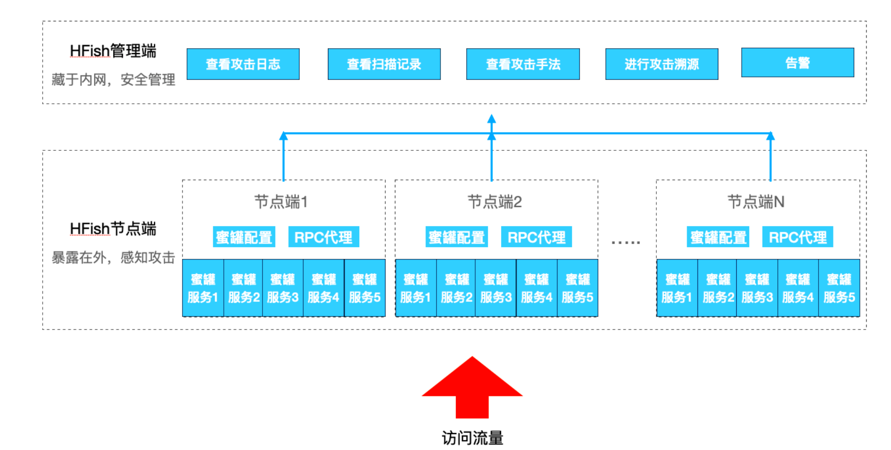


## Linux部署


一键部署：

```sh
firewall-cmd --add-port=4433/tcp --permanent   #（用于web界面启动）
firewall-cmd --add-port=4434/tcp --permanent   #（用于节点与管理端通信）
firewall-cmd --reload
```


```sh
bash <(curl -sS -L https://hfish.net/webinstall.sh)
```


```sh
登陆链接：https://[ip]:4433/web/
账号：admin
密码：HFish2021
```


手动安装：

https://hfish.cn-bj.ufileos.com/hfish-3.3.5-linux-amd64.tgz

https://hfish.cn-bj.ufileos.com/hfish-3.3.5-linux-arm64.tgz


解压：

```sh
tar zxvf hfish-3.3.5-linux-amd64.tgz -C /home/user/hfish
```


开放端口：

```sh
sudo firewall-cmd --add-port=4433/tcp --permanent   （用于web界面启动）
sudo firewall-cmd --add-port=4434/tcp --permanent   （用于节点与管理端通信）
sudo firewall-cmd --reload
```


运行：

```sh
cd /home/user/hfish
sudo ./install.sh
```


或者直接运行：

```sh
./server
```


登录：

```sh
登陆链接：https://[ip]:4433/web/
账号：admin
密码：HFish2021
```


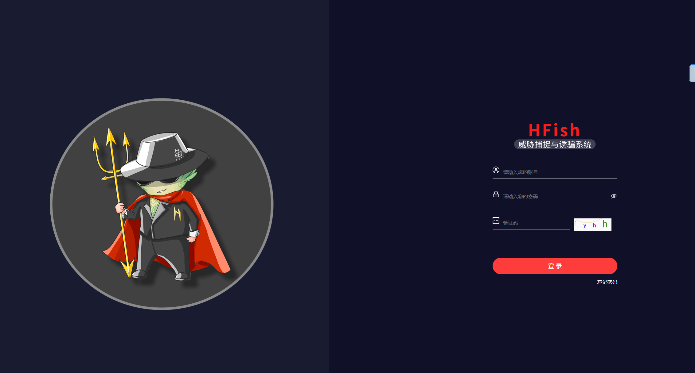


修改密码：

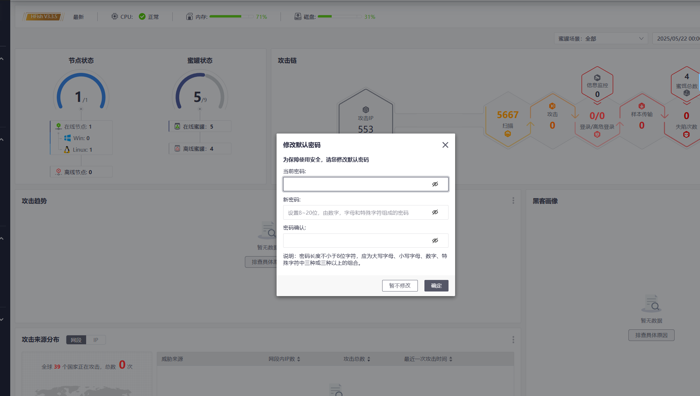


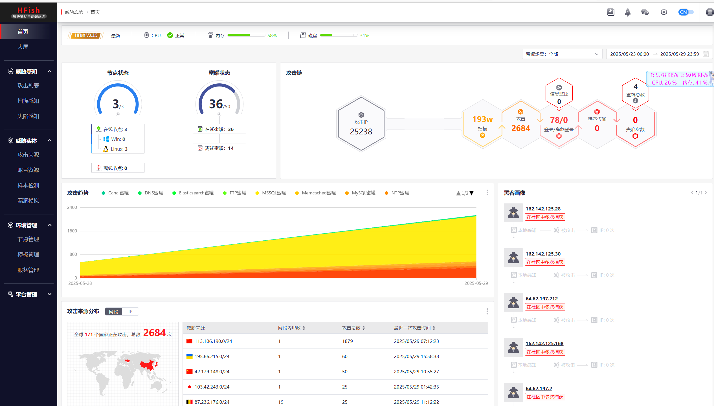


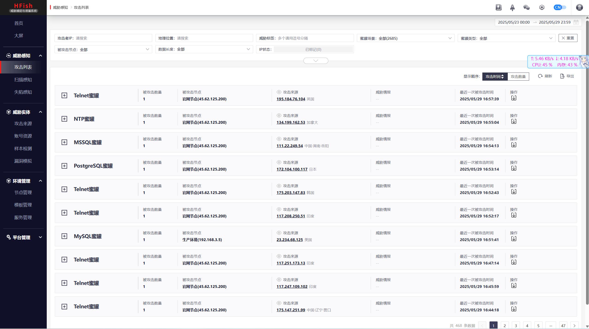


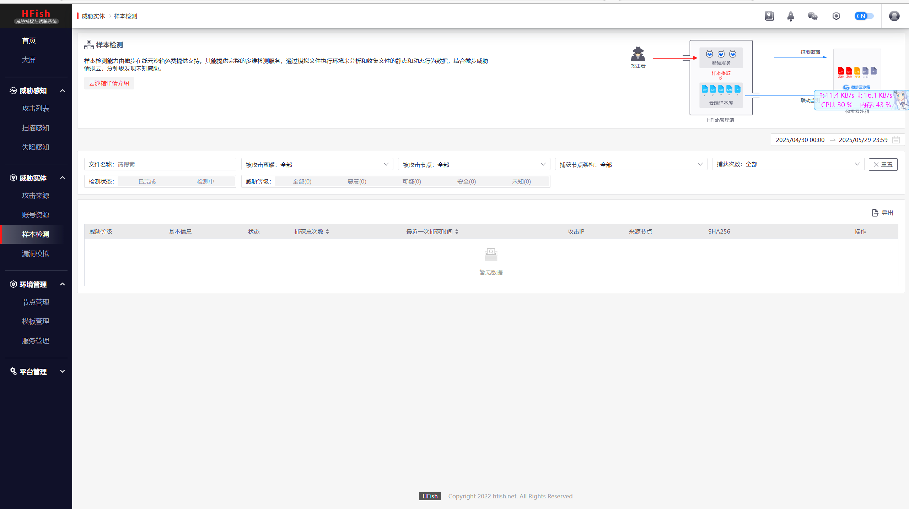


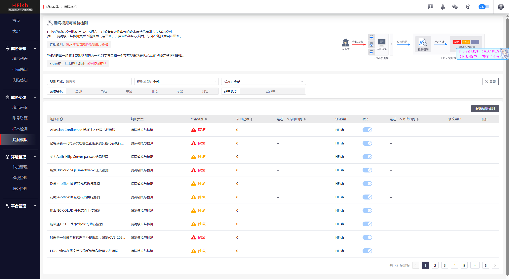


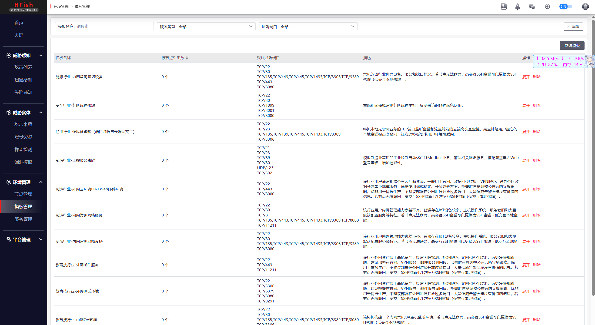


## Windows部署


下载：

https://hfish.cn-bj.ufileos.com/hfish-3.3.5-windows-amd64.tgz


在防火墙上放行TCP/4433、TCP/4434端口出入双向流量


安装包解压缩后，运行HFish-Windows-amd64目录下的install.bat


```sh
登陆链接：https://[ip]:4433/web/
账号：admin
密码：HFish2021
```


## Docker部署

```sh
docker run -itd --name hfish \
-v /usr/share/hfish:/usr/share/hfish \
--network host \
--privileged=true \
threatbook/hfish-server:latest
```


配置为后续自动升级:

```sh
docker run -d    \
 --name watchtower \
 --restart unless-stopped \
  -v /var/run/docker.sock:/var/run/docker.sock  \
  --label=com.centurylinklabs.watchtower.enable=false \
--privileged=true \
  containrrr/watchtower  \
  --cleanup  \
  hfish \
  --interval 3600
```


## 版本升级

HFish v2.7.0（含）及后续版本支持Web页面自动升级

联网情况：HFish v2.7.0（含）及后续版本中，HFish会自动检测到升级包，用户点击右上角火箭，点击「确认升级」，即可完成升级

非联网情况：HFish v2.7.0（含）及后续版本中，用户点击右上角火箭，点击「上传安装包」，点击「确认升级」，即可完成升级


## 数据库选择

除非性能极度紧张或环境所限，否则HFish官方**强烈建议使用MySQL/MariaDB数据库！**

经过实战测评，MySQL/MariaDB数据库可以适应目前绝大多数场景，其数据处理和并发兼容能力都要优于SQLite


HFish提供两种更换数据库的机会：

1、在首次安装时，用户可以选择使用SQLite或MySQL/MariaDB数据库

2、如果已经选择了SQLite，以管理员身份登录后，在「数据库配置」页面，根据指南可快速更换数据库


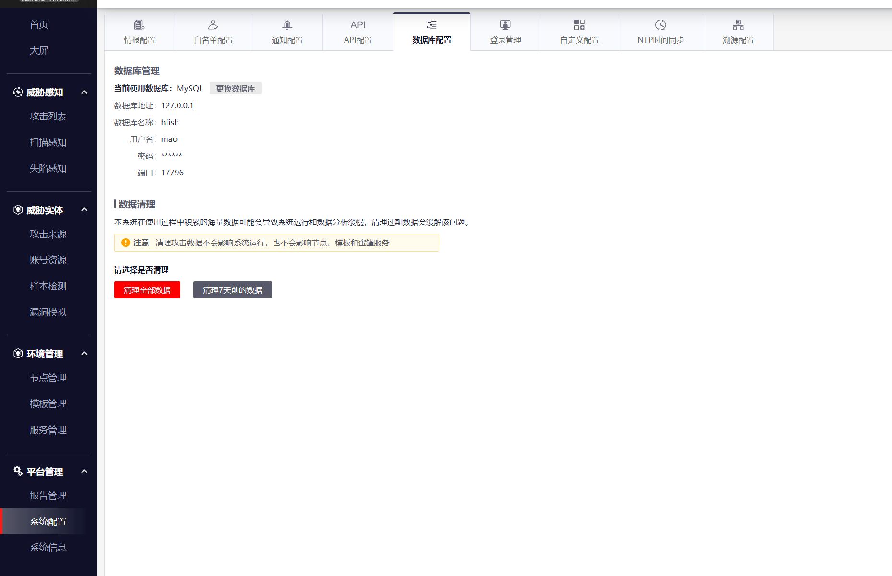


## 主动联网要求

为兼顾安全性和服务可用性，建议用户设置ACL仅允许HFish管理端主动访问如下网络域名、地址和端口：

| 开放IP                                                     | 对应开放域名                  | 协议/端口                                                | 访问目的                                         |
| ---------------------------------------------------------- | ----------------------------- | -------------------------------------------------------- | ------------------------------------------------ |
| 106.75.31.212、106.75.71.108                               | api.hfish.net（已经禁止ping） | TCP/443                                                  | 用于官网升级与攻击数据拉取，建议开启             |
| 106.75.5.50、106.75.15.34                                  | zoo.hfish.net（已经禁止ping） | TCP/22222（高交互ssh端口）、TCP/22223（高交互Telnet端口) | 用于与云端高交互蜜罐通信，建议开启               |
| 43.227.197.203、43.227.197.42                              | hfish.cn-bj.ufileos.com       | TCP/443                                                  | 用于分发安装和升级包                             |
| 106.75.36.224、123.59.51.113、123.59.72.253、106.75.36.226 | api.threatbook.cn             | TCP/443                                                  | 用于威胁情报查询，如果未启用该功能，无需开放     |
| （无法罗列，建议按域名开通）                               | open.feishu.cn                | TCP/443                                                  | 用于飞书告警功能，如果未使用该功能，无需开放     |
| （无法罗列，建议按域名开通）                               | oapi.dingtalk.com             | TCP/443                                                  | 用于钉钉告警功能，如果未使用该功能，无需开放     |
| （无法罗列，建议按域名开通）                               | qyapi.weixin.qq.com           | TCP/443                                                  | 用于企业微信告警功能，如果未使用该功能，无需开放 |


## 添加/删除节点

### 内置节点

安装HFish管理端后，在管理端所在机器上会默认建立节点感知攻击，该节点被命名为【内置节点】。

该节点将默认开启部分服务，包括FTP、SSH、Telnet、Zabbix监控系统、Nginx蜜罐、MySQL蜜罐、Redis蜜罐、HTTP代理蜜罐、ElasticSearch蜜罐和通用TCP端口监听


该节点不能被删除，但可以暂停


### 新增节点

进入【节点管理】页面，点击【增加节点】


### 删除节点

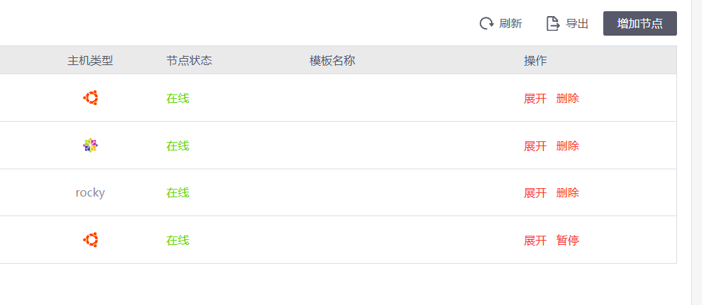


节点被删除后，节点端进程会自动退出，但程序会保留在原有路径，需要手动二次删除，管理端上已收集的关于该节点的所有攻击数据不会丢失，仍然能查看


## 添加/删除蜜罐

每个蜜罐服务必须由在节点程序构建，这里指的蜜罐服务例如MySQL、Redis等具体服务。因此用户必须先添加节点后才可以为节点配置蜜罐服务，HFish提供两种方式配置节点服务

### 直接修改蜜罐服务

点击单个节点，可直接对节点上的服务进行添加和删除


### 创建模版，应用到多节点

蜜罐模板便于用户同时管理很多节点，批量更改蜜罐服务，即将一套模板批量应用到多个节点上

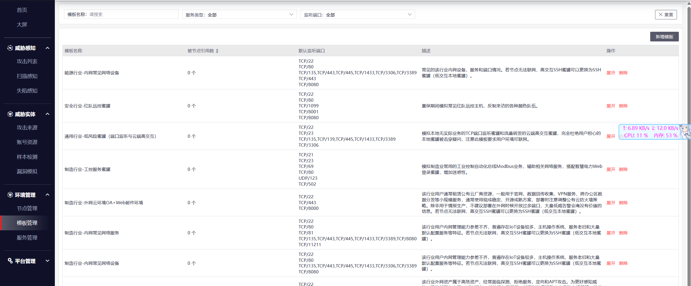


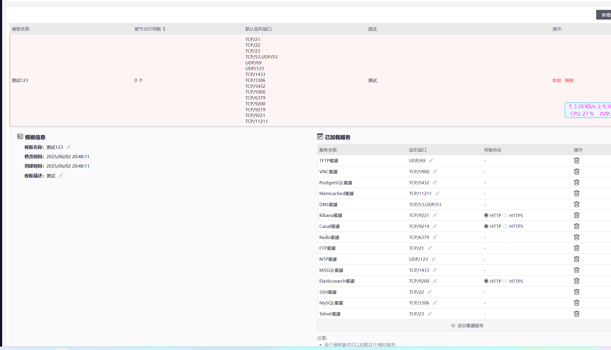


## 查看攻击详情

当前，HFish提供四个不同的页面进行**攻击详查看**，分别为：**攻击列表**、**扫描感知**、**攻击来源**、**账号资产**

四种功能分别代表四种不同的攻击数据场景

| 功能简介     | 功能原理                               |                                                              |
| ------------ | -------------------------------------- | ------------------------------------------------------------ |
| **攻击列表** | 收集所有对蜜罐的攻击                   | 节点部署蜜罐后，攻击者对蜜罐的**所有攻击信息**都会被收录到「攻击列表」中。 |
| **扫描感知** | 收集节点主机网卡的所有连接信息         | 节点生成之后，HFish会**记录对节点所有网卡的连接**，包括来访IP，连接IP和端口。 |
| **攻击来源** | 收集了所有连接和攻击节点的IP信息       | **所有**尝试连接和攻击节点的**IP信息**都被记录在攻击来源中，如果蜜罐溯源和反制成功，信息也会被记录其中。 |
| **账号资产** | 收集了所有攻击者爆破蜜罐使用的账号密码 | HFish会**记录**攻击者对所有蜜罐进行**暴力破解时使用的账号密码**，进行统一展示，用户还可**自定义监控词汇**，如员工姓名、公司名称等，一旦与攻击者使用的账号重合，可高亮显示并告警。 |


## 详细功能说明

### 首页

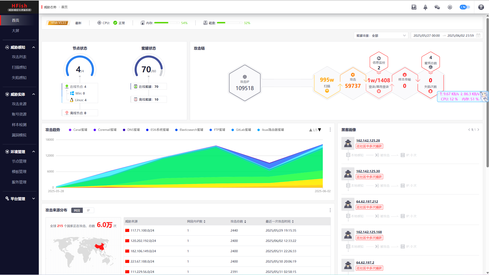


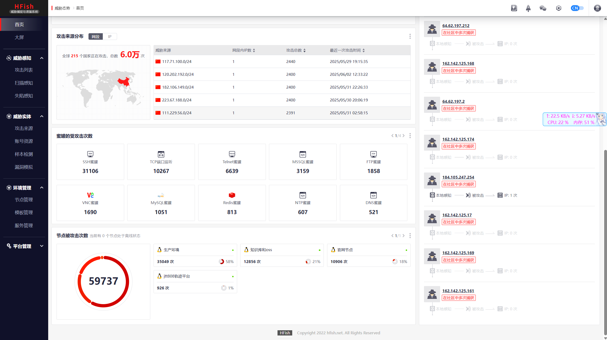


### 攻击列表

该页面用于展示、聚合、搜索、分析和导出HFish蜜罐捕获攻击数据的页面


攻击列表本身有一定的聚合能力，会把一段时间内，针对同一IP、同一蜜罐的同一攻击者行为聚合在一起


### 扫描感知

该页面用于展示HFish蜜罐节点被TCP、UDP和ICMP三种协议的全端口扫描探测行为

即使节点相关端口没有开放，HFish仍能记录下扫描行为，此外，HFish还会记录节点主机本身外联行为

注意：Windows节点的扫描感知依赖WinPcap，需要手动进行下载安装！

WinPcap官方链接：https://www.winpcap.org/install/bin/WinPcap_4_1_3.exe


HFish通过节点端构造“蜜罐服务”，因此，**部署节点的机器不建议运行任何正常业务**，但很多用户往往会将**正常业务使用的笔记本、虚拟机作为节点机器**。

这种情况下，扫描数据常常会记录下用户软件访问网络的信息，利用Windows用户中，HFish经常检测到TCP/445端口的被访问或访问情况


### 攻击来源

该页面用于通过汇聚本地蜜罐感知、云端情报、用户自定义情报和溯源反制获得的信息来刻画攻击者画像，成为企业的私有情报库

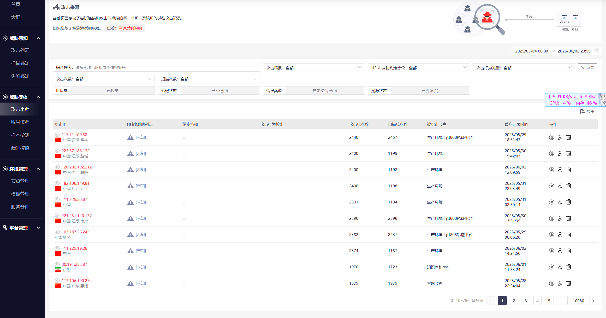


### 账号资产

该页面用于收集所有被用来攻击的账号密码，通过配置可对企业失陷账号进行有效监控

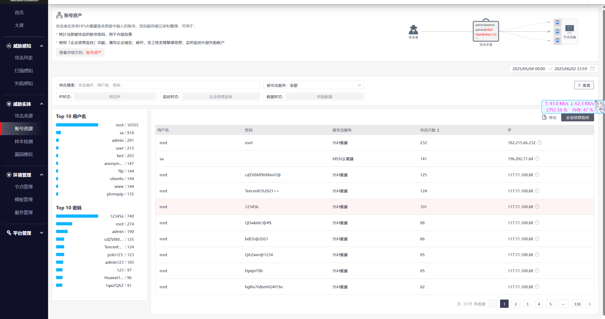


